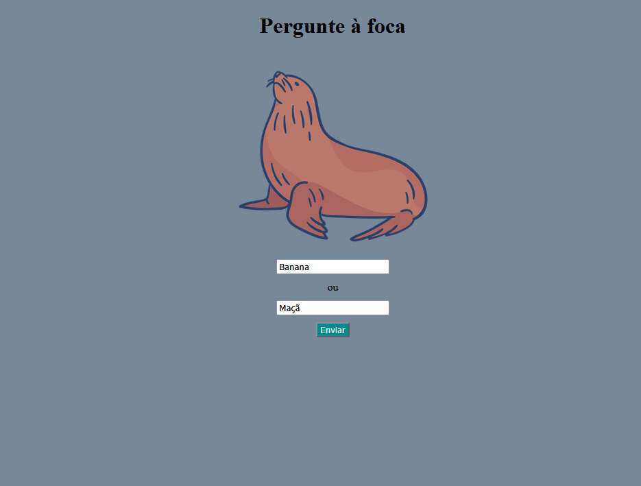

# Pergunte à foca - PS 26.1 CJR
Segunda questão relacionada ao **Processo Seletivo 2026.1** da Empresa Júnior CJR.  
## Uma foca mágica que decide entre duas opções e resolve a sua indecisão!
**Clique [aqui](https://yanrdgs-dev.github.io/pergunte-a-foca/) para experimentar!**
